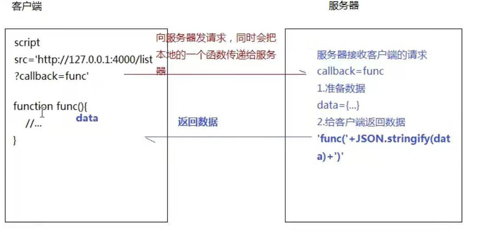

# 跨域解决方案

* JSONP跨域解决方案
* CORS跨域资源共享
* 基于http proxy实现跨域请求
* 基于post message实现跨域处理
* 基于iframe的跨域解决方案：`window.name/document.domin/localion.hash`

  

**JSONP跨域解决方案**
  
1.不存在跨域请求的限制的标签 
Script、img、link、iframe... 

2.JSONP 原理  

  
3.jsonp虽然很简单，但是有如下缺点： 
* JSONP只能处理GET请求
* 安全问题(请求代码中可能存在安全隐患)
* 要确定jsonp请求是否失败并不容易

**CORS跨域资源共享**
  
CORS分为简单请求和非简单请求(需预检请求)两类 

1.简单请求
请求方式使用下列方法之一：GET、HEAD、POST 

Content-Type 的值仅限于下列三者之一：text/plain、multipart/form-data、application/x-www-form-urlencoded 
2.其他的就为非简单请求  
CORS字段介绍：  
Access-Control-Allow-Origin: http://localhost:3001  `//该字段表明可供那个源跨域` 
Access-Control-Allow-Methods: GET, POST, PUT `// 该字段表明服务端支持的请求方法` 
Access-Control-Allow-Headers: X-Custom-Header`// 实际请求将携带的自定义请求首部字段`  
注：`Access-Control-Allow-Origin 可以写具体地址与*，如写具体地址，只能写一个，如写*表明支持多源`

**基于http proxy实现跨域请求**
 
**基于post message实现跨域处理**
 
**基于iframe的跨域解决方案：`window.name/document.domin/localion.hash`**
  
document.domin 
只能实现：同一个主域，不同子域之间的操作

